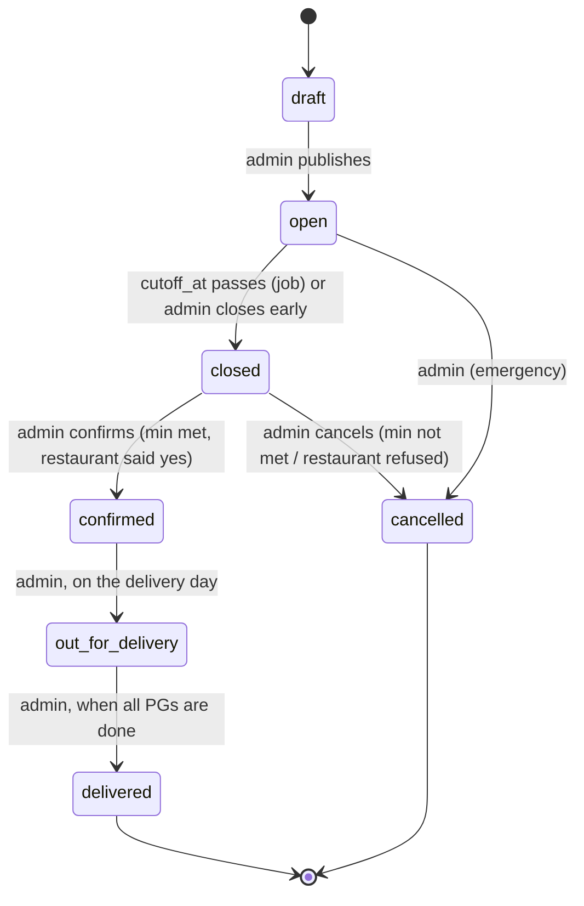
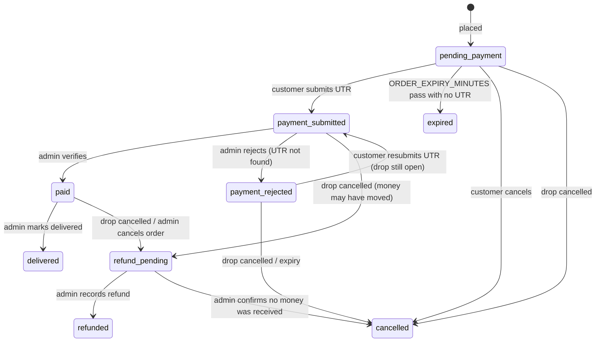

# Weekend Drop — v1 Plan

> Working codename: **Weekend Drop** (`weekend-drop`). Rename freely; nothing depends on the name.
> This file is the single source of truth for v1. Feed it to the coding agent as-is. Sections are numbered so you can say "do Phase 3" or "re-read §14".

---

## 0. How to use this file (instructions for the coding agent)

Read this entire file before writing any code. Then:

1. Work **one phase at a time** (§16). Do not start the next phase until the founder says go.
2. At the start of a phase, list the files you will create/modify and any new dependencies. Wait for a nod if the list is large or surprising.
3. At the end of a phase, report: what was built, how to run it, how to test it manually, anything you assumed. Then **stop**.
4. If anything in this file is unclear or contradictory, **ask**. If you must assume, record the assumption in `DECISIONS.md` at the repo root.
5. Do not add features that are not in this file. If you think one is needed, add it to the "Later" list (§19) and ask.
6. Keep dependencies minimal. Prefer what's already in the repo. Justify every new package in one line.
7. Money is always integer **paise**. Never floats. Never `number` arithmetic on rupees.
8. Never trust `drop.status` alone for "is ordering open" — always also check `cutoff_at` and capacity (§14).
9. Every write that affects capacity (placing an order, submitting a UTR) runs inside a transaction with a row lock on the drop (§14).
10. Tests are mandatory only for the business rules in §14 (state transitions, capacity, totals, UTR rules, Razorpay signature). Don't write UI snapshot tests.
11. Small commits, conventional commit messages. Never run a destructive migration (`drop`, `truncate`, column removal) without asking.
12. Code must stay **host-agnostic**: no Vercel-only APIs (no Vercel Cron, no Vercel KV), no Render-only assumptions. Hosting can change.
13. All timestamps are `timestamptz` in UTC in the DB; all display is `Asia/Kolkata`.
14. **Context Protocol (agent tooling is already installed):** skills live in `.claude/skills/{backend,web}/`, specialized agents in `.claude/agents/{backend,web}/`. Before starting any task, read `.claude/context/codebase-state.md` (live inventory of modules, endpoints, tables, pages) instead of scanning the repo; after any change, update its inventory tables and append a Change Log line. A phase is not done until the context file reflects it. Where an imported skill convention conflicts with this file, **this file wins** (see §7.1 note).

---

## 1. What we're building

A **scheduled batch pre-order service**, not a real-time delivery app.

Every weekend we pick one famous, usually far-away, usually crowded restaurant. We publish a **drop**: a curated menu of 5–8 items, a fixed delivery date and window, and an order **cutoff** (typically Friday night). Customers in a handful of nearby PGs (paying-guest hostels) order and pay before the cutoff. After cutoff, if the minimum order count is met, we place one bulk order with the restaurant, drive there, pick it up, and deliver to each PG's gate in the delivery window. If the minimum isn't met, we cancel and refund everyone.

**Team:** 3 people. Two handle restaurant pickup + PG delivery. One handles the app, ops, and marketing. This constraint drives every decision: the software must be small, and the admin panel must do the boring ops work (aggregation, packing lists, payment checks).

**Pilot goal:** run 3–6 weekend drops, learn whether people order, what they order, how much friction manual UPI adds, and whether restaurants cooperate. Then decide what to scale.

---

## 2. Locked decisions

| Area | Decision | Why |
|---|---|---|
| Architecture | Monorepo: `apps/web` (Next.js), `apps/api` (NestJS), `packages/shared` (zod schemas + types) | Founder is fluent in both; free hosting exists for both |
| Browser ↔ API | **BFF pattern.** Browser talks only to Next.js. Next.js server calls NestJS with an internal key and forwards identity headers. NestJS is never called from the browser (except `/health` and the future Razorpay webhook) | Avoids cross-domain cookies/CORS between `*.workers.dev`/`*.vercel.app` and `*.onrender.com`; keeps API private |
| Database | PostgreSQL on **Neon** (free tier), **Drizzle ORM** + `drizzle-kit` migrations. Only `apps/api` touches the DB | Founder preference; Neon free is enough for pilot |
| Auth | **Auth.js v5** in Next.js with **Google** provider. Customers can order **without an account** (guest checkout). Admins = Google sign-in + email allowlist | No SMS cost; guest checkout removes signup friction |
| Payments | Provider abstraction. **v1 uses `manual_upi`**: customer pays to our UPI ID via deep link/QR, enters the 12-digit UTR, admin verifies. **Razorpay provider is built in Phase 7** and enabled by env flag after FSSAI/KYC | Founder can't complete Razorpay KYC yet |
| Notifications | **Manual WhatsApp** in v1. Admin panel generates copy-ready messages. No automated messaging, no email | WhatsApp Business API is a project in itself; pilot volume is small |
| Hosting | API: **Render** free web service. DB: Neon free. Web: see §7.4 (Cloudflare Workers via OpenNext preferred; Vercel Hobby is non-commercial-only per its ToS) | ₹0/month until Razorpay |
| Delivery unit | Fixed list of **delivery points** (PGs) managed by admin. One drop point per PG. No door-to-room, no free-text addresses | Two delivery people |
| Menu | Each drop has its own **snapshot** of items and prices. Restaurants table stores only name/contact/notes | Prices and availability change per weekend |
| Money | Integer paise everywhere. Selling price set by admin per item (markup baked in). Optional hidden cost price for margin tracking. Flat delivery fee per order, set per drop | Simple, no rounding bugs |
| UI | Tailwind CSS, mobile-first (customers are on phones). Admin is desktop-first but must work on a phone (delivery people will use it at the PG gate) | |

**Founder's condition, recorded:** if hosting NestJS separately ever requires payment, collapse the API into Next.js route handlers. The BFF pattern makes this cheap: the web app already owns all browser-facing routes.

---

## 3. Non-goals for v1

No live tracking. No rider app. No maps. No ratings/reviews. No coupons or referral codes. No multiple restaurants in one drop. No user-entered addresses. No automated WhatsApp/SMS/email. No mobile app. No inventory sync with restaurants. No self-service refund. No multi-city / multi-zone. No analytics vendor (we log events to our own table). No i18n.

---

## 4. Glossary

- **Drop** — one scheduled restaurant run: menu + cutoff + delivery window + capacity.
- **Cutoff** — the moment ordering closes. Stored as `cutoff_at` (timestamptz).
- **Delivery point** — a PG (or similar) where we hand over food at the gate.
- **Order** — one customer's items for one drop, delivered to one delivery point.
- **Order code** — short human code on every order, e.g. `WD-7K3M`. Used as the UPI payment note and in all WhatsApp messages.
- **Access token** — long random secret in the order URL (`/o/<token>`). How guests get back to their order.
- **UTR** — UPI transaction reference (12 digits) the customer submits as proof of payment.
- **Confirmed order** — an order whose payment has been verified (`status = paid`).

---

## 5. Domain model & lifecycles

### 5.1 Drop lifecycle



Rules:
- Only `open` drops are visible to customers as orderable. `closed`/`confirmed`/`out_for_delivery` drops are visible read-only to customers who have an order in them.
- At most **one** drop is `open` at a time in v1 (enforce in service layer; schema allows more for later).
- `open → closed` happens automatically when `cutoff_at` passes (scheduled job every minute) **and** is also enforced lazily: the API rejects new orders once `now() >= cutoff_at` regardless of status.
- `closed → cancelled` triggers the refund flow on every order that is `paid` or `payment_submitted` (§5.3).
- Timestamps recorded on each transition: `opened_at, closed_at, confirmed_at, out_for_delivery_at, delivered_at, cancelled_at` + `cancel_reason`.

### 5.2 Order lifecycle



- **Counts toward capacity:** `pending_payment` (not yet expired), `payment_submitted`, `paid`. Nothing else.
- **Counts as "confirmed" for the public progress bar and the restaurant sheet:** `paid` only.
- `expired` orders: the status page says "If you already paid, message us on WhatsApp with your order code" (wa.me link). Admin can **revive** an expired order (→ `payment_submitted` with the UTR) if capacity allows.
- Customers cannot self-cancel after paying in v1. They message WhatsApp; admin cancels → `refund_pending`.

### 5.3 Payment lifecycle (one row per attempt)

`pending → submitted → verified | rejected`; `verified → refund_pending → refunded`.

- Manual UPI: `submitted` when the customer enters a UTR; `verified`/`rejected` by admin.
- Razorpay (Phase 7): `pending` on Razorpay order creation; `verified` on `payment.captured` webhook with valid signature; refunds via API set `refund_pending` → `refunded` on `refund.processed` webhook.
- An order has many payment attempts; `orders.status` reflects the latest.

---

## 6. Data model

All tables have `id uuid pk default gen_random_uuid()`, `created_at timestamptz default now()`, `updated_at timestamptz` unless noted. Enums are Postgres enums defined in `packages/shared` and mirrored in Drizzle.

```
users
  email            text unique not null
  name             text
  image            text
  phone            text                      -- optional, set by user in /account
  default_delivery_point_id uuid → delivery_points
  is_admin         boolean default false     -- synced from ADMIN_EMAILS on each sign-in
  last_login_at    timestamptz

restaurants
  name, area, address, phone, notes text
  is_active        boolean default true

delivery_points                              -- PGs
  name             text not null             -- "Sri Sai PG (Gents)"
  area             text                      -- "Marathahalli"
  landmark         text                      -- "Gate next to Chai Point"
  handover_notes   text                      -- "Call security, they let us in"
  sort_order       int default 0
  is_active        boolean default true

drops
  restaurant_id    uuid → restaurants not null
  title            text not null             -- auto: "Meghana Foods — Sat 4 Oct"
  description      text                      -- customer-facing blurb
  status           drop_status not null default 'draft'
  cutoff_at        timestamptz not null
  delivery_starts_at timestamptz not null
  delivery_ends_at   timestamptz not null
  min_orders       int not null              -- go/no-go threshold
  max_orders       int not null              -- hard cap
  delivery_fee_paise int not null default 0
  customer_notes   text                      -- "Food arrives at your PG gate; we'll message the group"
  internal_notes   text                      -- admin only
  opened_at, closed_at, confirmed_at, out_for_delivery_at, delivered_at, cancelled_at timestamptz
  cancel_reason    text

drop_items
  drop_id          uuid → drops not null (on delete cascade)
  name             text not null
  description      text
  price_paise      int not null              -- selling price incl. markup
  cost_price_paise int                       -- hidden, for margin
  is_veg           boolean not null default true
  max_qty_per_order int not null default 5
  max_total_qty    int                       -- null = unlimited
  sort_order       int default 0
  is_available     boolean default true

drop_delivery_points                          -- which PGs this drop serves
  drop_id          uuid → drops
  delivery_point_id uuid → delivery_points
  primary key (drop_id, delivery_point_id)

orders
  code             text unique not null      -- WD-7K3M
  access_token     text unique not null      -- 32 random bytes, hex
  idempotency_key  text unique               -- from client, prevents double-place
  drop_id          uuid → drops not null
  user_id          uuid → users              -- null for guests
  delivery_point_id uuid → delivery_points not null
  customer_name    text not null
  customer_phone   text not null             -- 10-digit Indian mobile, stored normalised
  customer_note    text                      -- "Room 204, call on arrival"
  refund_upi_id    text                      -- optional, collected at UTR step
  status           order_status not null default 'pending_payment'
  subtotal_paise, delivery_fee_paise, total_paise int not null  -- frozen at placement
  expires_at       timestamptz not null      -- placed_at + ORDER_EXPIRY_MINUTES
  paid_at, delivered_at, cancelled_at, refunded_at timestamptz
  client_ip        text
  index (drop_id, status), index (customer_phone), index (user_id)

order_items
  order_id         uuid → orders not null (cascade)
  drop_item_id     uuid → drop_items not null
  name_snapshot    text not null
  unit_price_paise int not null
  qty              int not null check (qty > 0)
  line_total_paise int not null

payments
  order_id         uuid → orders not null
  provider         payment_provider not null  -- 'manual_upi' | 'razorpay'
  status           payment_status not null    -- pending|submitted|verified|rejected|refund_pending|refunded|failed
  amount_paise     int not null
  upi_ref          text unique                -- UTR; unique across ALL payments (anti-reuse)
  submitted_at, verified_at, rejected_at, refunded_at timestamptz
  verified_by_user_id uuid → users
  rejection_reason text
  refund_ref       text                       -- UTR of our refund transfer
  provider_order_id, provider_payment_id, provider_refund_id text   -- Razorpay
  raw_payload      jsonb                      -- webhook body, for audit

events                                        -- pilot funnel metrics, no vendor
  type             text not null   -- drop_viewed|checkout_started|order_placed|utr_submitted|payment_verified|payment_rejected|order_expired|order_revived|drop_confirmed|drop_cancelled|order_delivered
  drop_id, order_id uuid
  actor            text            -- 'guest' | user_id | 'system' | 'admin:<user_id>'
  meta             jsonb
  index (drop_id, type)
```

Enums:
- `drop_status`: `draft, open, closed, confirmed, out_for_delivery, delivered, cancelled`
- `order_status`: `pending_payment, payment_submitted, paid, payment_rejected, expired, cancelled, refund_pending, refunded, delivered`
- `payment_provider`: `manual_upi, razorpay`
- `payment_status`: `pending, submitted, verified, rejected, refund_pending, refunded, failed`

Order code generation: `WD-` + 4 chars from alphabet `23456789ABCDEFGHJKMNPQRSTUVWXYZ` (no 0/O/1/I/L). Retry on unique-violation.

---

## 7. Architecture

### 7.1 Repo layout

```
weekend-drop/
  apps/
    web/            Next.js 15+ (App Router, TS, Tailwind). Customer site + admin panel. No DB access.
    api/            NestJS 11+ (TS). Owns DB, business rules, jobs, payment providers.
  packages/
    shared/         zod schemas (request/response DTOs), enums, money + date helpers. Imported by both apps.
  PLAN.md           this file
  DECISIONS.md      assumptions the agent made
  pnpm-workspace.yaml
  .env.example      (one per app: apps/web/.env.example, apps/api/.env.example)
```

pnpm workspaces. No Turborepo/Nx unless the agent finds a concrete need (ask first). Root scripts: `dev` (both apps), `build`, `test`, `lint`, `db:generate`, `db:migrate`, `db:seed`.

Also in the repo (agent tooling, already set up 2026-09-22): `.claude/skills/` (backend = NestJS patterns, web = Next.js patterns, mobile staged for later), `.claude/agents/` (backend ×12, web ×7, mobile ×1), `.claude/context/codebase-state.md` (live codebase snapshot — see §0.14), `.claude/hooks/` (guard against editing vendored/generated files; lint + type-check on web TS/TSX edits).

> **Note on imported skill conventions:** the skills were imported from a prior project and assume a generated SDK (`@food/sdk`) and SQL-first hand-written migrations. For Weekend Drop, **this plan wins**: browser data flows through the BFF with zod DTOs from `packages/shared` (no generated SDK in v1), and migrations are generated with `drizzle-kit` (§2). Treat the affected skills (`backend/migration.md`, `backend/swagger.md`, `web/api-hooks.md`, `backend-client-sdk-generator`) as pattern reference only.

### 7.2 Request flow (BFF)

```
Browser ──(same-origin, Auth.js cookie)──▶ Next.js server (route handlers / server actions)
                                              │  fetch(API_BASE_URL + path, {
                                              │    headers: {
                                              │      'X-Internal-Key': INTERNAL_API_KEY,
                                              │      'X-Actor-Type': 'guest' | 'user',
                                              │      'X-User-Id', 'X-User-Email'   (when signed in)
                                              │      'X-Client-IP'                 (forwarded)
                                              │  }})
                                              ▼
                                           NestJS ──▶ Neon Postgres
```

- NestJS `InternalKeyGuard` (global): rejects any request without a valid `X-Internal-Key`, except `GET /health` and `POST /v1/webhooks/razorpay`.
- NestJS `ActorGuard` builds `req.actor = { type, userId?, email? }` from headers. `AdminGuard` requires `actor.email ∈ ADMIN_EMAILS` **and** `users.is_admin = true`.
- Next.js has a single `apiClient()` helper that attaches these headers from the Auth.js session. Never build the headers inline elsewhere.
- Rate limiting: `@nestjs/throttler` keyed on `X-Client-IP` for `POST /v1/orders`, `POST /v1/orders/by-token/:token/utr`, `POST /v1/orders/lookup` (e.g. 10/min). Return `429` with a friendly message.
- Timeouts: Next.js fetches to the API use a 30 s timeout (Render cold start can take ~1 min). Customer pages show a "waking up…" state, not a hard error, on timeout and offer a retry.

### 7.3 Auth flow

- Auth.js v5, Google provider, JWT session strategy (no DB adapter — the API owns users).
- On `signIn` callback: Next.js calls `POST /v1/users/upsert { email, name, image }` → API returns `{ id, is_admin }`. Store `id` and `is_admin` in the JWT. `is_admin` is recomputed from `ADMIN_EMAILS` on every sign-in.
- Admin routes (`/admin/**`) are protected in Next.js middleware (session + `is_admin`) **and** in NestJS (`AdminGuard`). UI gating is convenience; the API is the source of truth.
- Guest checkout needs no session. Guest orders are reachable only via `/o/<access_token>` or "find my order" (§8.6).
- **Do not** auto-attach guest orders to an account by matching phone number. Phone is unverified with Google sign-in; matching would let anyone read someone else's orders by typing their number.

### 7.4 Hosting (₹0 target)

| Piece | Host | Notes |
|---|---|---|
| API | Render, free web service | Spins down after 15 min idle; cold start ~1 min; 750 free instance-hours/month. Render discourages keep-alive pinging — don't rely on it. Mitigations: 30 s timeouts + "waking up" UI; admin opens the site right before announcing a drop on WhatsApp. If cold starts hurt the pilot, exercise the founder's condition (§2) and fold the API into Next.js. |
| DB | Neon, free tier | Use the **pooled** connection string. Neon suspends compute after idle and wakes in ~0.5 s; the `pg` pool must tolerate dropped connections (set `idleTimeoutMillis` low, handle `ECONNRESET` with one retry). |
| Web | **Cloudflare Workers via OpenNext** (free, commercial use allowed, no spin-down) — preferred. Alternatives: Render free web service (spin-down applies), or Vercel Pro (paid). **Vercel Hobby is not an option**: its ToS restricts it to personal, non-commercial use, and we take money. | Web has no DB and no heavy Node deps, so OpenNext compatibility risk is low. Confirm Auth.js + `qrcode` work on Workers in Phase 6 before committing. |
| Scheduled jobs | `@nestjs/schedule` inside the API | Every minute: close drops past cutoff, expire pending orders. Correctness never depends on the job running (lazy checks in §14). |
| Domain | Optional | Free subdomains are fine for the pilot. |

---

## 8. Customer app spec (`apps/web`, public routes)

Mobile-first. Fast. No login wall anywhere in the ordering flow.

### 8.1 `/` — Home
- If a drop is `open`: hero with restaurant name, delivery date + window, **countdown to cutoff**, delivery fee, progress ("**14 confirmed** · goes ahead at 20 · 40 max" — `paid` count only), menu list (name, veg dot, description, price, qty stepper, "sold out" when `max_total_qty` reached), sticky bottom bar with item count + total + **Order** button. Show the list of PGs served. Log `drop_viewed`.
- If the drop is `open` but `max_orders` reached: menu read-only, "This drop is full".
- If no drop is `open`: "Next drop announced on WhatsApp" + join-group link (`NEXT_PUBLIC_WHATSAPP_GROUP_URL`) + support link. Optionally show the most recent `confirmed`/`delivered` drop as "last weekend".

### 8.2 `/checkout` — Checkout (guest or signed in)
- Cart (from client state, re-validated server-side), delivery point select (only PGs in `drop_delivery_points`), name, 10-digit phone, optional note (room number / call on arrival), optional "Sign in with Google to save your details" (non-blocking).
- If signed in: prefill name/phone/PG from the user record.
- Order summary: subtotal + delivery fee = total. Text: "You'll pay via UPI on the next screen. Your spot is held for {ORDER_EXPIRY_MINUTES} minutes."
- **Place order** → `POST /v1/orders` with a client-generated `idempotency_key` (uuid, generated once per checkout visit). On success → `/o/<token>`. Log `checkout_started` on page load, `order_placed` on success (API logs the latter).
- Errors to handle explicitly: drop closed, drop full, item sold out / qty reduced, item unavailable, phone invalid, API waking up.

### 8.3 `/o/[token]` — Order page (single page, renders by status)
- **`pending_payment`**: amount, order code, expiry countdown. **"Pay ₹X with UPI"** button → `upi://pay?pa={UPI_VPA}&pn={UPI_PAYEE_NAME}&am={rupees}&cu=INR&tn={code}`. QR code of the same URI (render client-side with `qrcode`), shown by default on desktop, behind a "Show QR" toggle on mobile. Copyable UPI ID. Then: **"I've paid — enter UTR"** form: 12-digit UTR (numeric, exactly 12), optional "UPI ID for refunds", helper text + tiny screenshots/text on where to find the UTR in GPay/PhonePe/Paytm ("UPI transaction ID" / "UTR" / "Ref no"). Submit → `POST /v1/orders/by-token/:token/utr`.
- **`payment_submitted`**: "Payment received, verifying. Usually within a few hours; before cutoff at the latest." Show UTR entered.
- **`paid`**: "Confirmed ✅". Items, PG, delivery window, what happens next (we message the WhatsApp group when food reaches the gate; bring the order code).
- **`payment_rejected`**: reason + resubmit UTR form (if drop still `open` and not expired) + WhatsApp link.
- **`expired`**: "Order expired. If you already paid, message us on WhatsApp with code {code}" → `wa.me/{SUPPORT_WHATSAPP}?text=...`. Button: "Order again".
- **Drop `cancelled` / order `refund_pending` / `refunded`**: "This weekend's drop was cancelled ({reason}). Refund of ₹X to {refund_upi_id or 'your UPI'} {status text}."
- **`delivered`**: "Delivered. Thanks!" + WhatsApp link for issues.
- Always: order code big and copyable, support WhatsApp link with prefilled text including the code, "Save this link" hint for guests.

### 8.4 `/account` (signed in)
Order history (from `GET /v1/me/orders`), editable name/phone/default PG.

### 8.5 `/auth/*`
Auth.js routes. Sign-in button lives in the header (small) and on checkout (optional). Never required.

### 8.6 `/find` — Find my order
Phone + order code → `POST /v1/orders/lookup` → redirect to `/o/<token>`. Rate limited. Both fields must match.

### 8.7 `/how-it-works`, `/refunds`
Static pages. Refund policy text from founder (§18).

---

## 9. Admin panel spec (`apps/web/app/admin/**`, admin only)

Desktop-first, phone-usable. Plain tables and forms. No charts library.

### 9.1 Drops
- List (status, restaurant, delivery date, paid/submitted/pending counts, min/max).
- Create / edit form: restaurant, title (auto-suggested), description, delivery date + window, cutoff (default: delivery date − 1 day, 21:00 IST), min/max orders, delivery fee, customer notes, internal notes, delivery points served (checkboxes, default all active), **items** (inline editable rows: name, desc, price ₹, cost ₹, veg, max/order, max total, available).
- **Duplicate** a previous drop (copies items and settings, clears dates/status).
- Editing rules: `draft` — everything editable. `open` — can edit description/notes/max_orders (≥ current active count)/item availability/max_total_qty (≥ sold)/cutoff (only later, not earlier — ask founder if earlier is ever needed); cannot change prices or remove items. `closed`+ — read-only except notes.

### 9.2 Drop dashboard (`/admin/drops/[id]`)
- Big numbers: paid · awaiting verification · pending · expired/rejected · capacity used. Progress vs min/max. Revenue (paid) and estimated margin (if cost prices set).
- Funnel for this drop from `events`: views → checkouts → placed → UTR submitted → verified.
- Actions with confirm dialogs: Publish (draft→open), Close now, **Confirm** (needs `paid ≥ min_orders`; allow override with a typed reason), **Cancel** (reason required; triggers refund queue), Out for delivery, Delivered.
- Links to: Verify payments, Restaurant sheet, Packing list, Refunds, WhatsApp messages.

### 9.3 Verify payments (`/admin/drops/[id]/payments`)
Queue of `payment_submitted` orders: code, name, phone, amount, UTR (copyable), submitted time. Buttons: **Mark paid**, **Reject** (reason dropdown: UTR not found / amount mismatch / duplicate / other + text). Also lists recently verified/rejected for undo (undo allowed within 10 minutes, logged). Keyboard-friendly.

### 9.4 Restaurant sheet (`/admin/drops/[id]/sheet`)
Aggregated over `paid` orders: item → total qty; total orders; total food value (cost price if present). **Copy as text** button producing a plain message you can send/read to the restaurant. Printable.

### 9.5 Packing list (`/admin/drops/[id]/packing`)
Grouped by delivery point → orders sorted by code → each line: code, name, phone (tap to call), items + qty, note. Per-PG: count of orders, count of each item (for bagging). Checkbox per order to mark delivered (works offline-ish: optimistic UI, retries). **Mark all delivered** per PG. Printable; phone-usable.

### 9.6 Refunds (`/admin/drops/[id]/refunds`)
`refund_pending` orders: code, name, phone, amount, `refund_upi_id` (or "ask customer"), UTR they paid with. **Mark refunded** with our refund reference. **No money received** → order `cancelled`.

### 9.7 Orders (`/admin/orders`)
Search by code / phone / name; filter by drop/status. Row → detail: timeline (from events + timestamps), payment attempts, actions: cancel (with refund if paid), **revive** expired order (enter UTR), edit note/PG.

### 9.8 WhatsApp messages (`/admin/drops/[id]/messages`)
Copy-ready templates filled from drop data (edit before sending):
1. **Drop is live** — restaurant, delivery day/window, cutoff, link, "goes ahead at N orders".
2. **Reminder** — "X confirmed, cutoff in Y hours".
3. **Confirmed** — "We're going! Food reaches your PG gate between …".
4. **Arrived at PG {name}** — "At the gate now, bring your order code".
5. **Cancelled** — reason, refund timeline.

### 9.9 Restaurants, Delivery points
Simple CRUD tables with active toggles.

### 9.10 Settings (read-only display)
Shows current `PAYMENT_PROVIDER`, `UPI_VPA`, `ADMIN_EMAILS`, `ORDER_EXPIRY_MINUTES` so the founder can confirm env is right on prod.

---

## 10. API spec (`apps/api`, all under `/v1`, JSON)

All bodies/responses validated with zod schemas from `packages/shared` (use a `ZodValidationPipe`). Errors: `{ error: { code, message, details? } }` with proper HTTP status. Codes the web app switches on: `DROP_NOT_OPEN, DROP_FULL, ITEM_SOLD_OUT, ITEM_UNAVAILABLE, QTY_EXCEEDS_LIMIT, ORDER_EXPIRED, ORDER_NOT_PENDING, UTR_INVALID, UTR_ALREADY_USED, INVALID_TRANSITION, NOT_FOUND, RATE_LIMITED, FORBIDDEN`.

**Public (guest or user):**
- `GET  /health` — `{ ok: true, db: true|false }`. No internal key required.
- `GET  /drops/current` — the `open` drop (or latest non-draft for the "last weekend" card) with items, delivery points, counts `{ paid, capacity_used, min_orders, max_orders }`, item `sold_qty`. Logs `drop_viewed` when `?view=1`.
- `POST /orders` — `{ drop_id, delivery_point_id, customer_name, customer_phone, customer_note?, items: [{drop_item_id, qty}], idempotency_key }` → order (with `access_token`). Attaches `user_id` if actor is a user.
- `GET  /orders/by-token/:token` — order + items + drop summary + latest payment + UPI URI (when pending).
- `POST /orders/by-token/:token/utr` — `{ upi_ref, refund_upi_id? }` → order.
- `POST /orders/by-token/:token/cancel` — only if `pending_payment`.
- `POST /orders/lookup` — `{ customer_phone, code }` → `{ access_token }`.

**User:**
- `POST /users/upsert` — called by Auth.js on sign-in. `{ email, name, image }` → `{ id, is_admin }`.
- `GET  /me` / `PATCH /me` — `{ name, phone, default_delivery_point_id }`.
- `GET  /me/orders`.

**Admin (AdminGuard):**
- `GET/POST /admin/restaurants`, `PATCH /admin/restaurants/:id`
- `GET/POST /admin/delivery-points`, `PATCH /admin/delivery-points/:id`
- `GET/POST /admin/drops`, `GET/PATCH /admin/drops/:id`, `POST /admin/drops/:id/duplicate`
- `POST /admin/drops/:id/transition` — `{ to: drop_status, reason? }` (one endpoint, state machine validates)
- `GET  /admin/drops/:id/dashboard` — counts, revenue, funnel
- `GET  /admin/drops/:id/sheet` — aggregation
- `GET  /admin/drops/:id/packing` — grouped orders
- `GET  /admin/drops/:id/payments?status=submitted`
- `POST /admin/payments/:id/verify`, `POST /admin/payments/:id/reject` `{ reason }`, `POST /admin/payments/:id/undo`
- `GET  /admin/drops/:id/refunds`, `POST /admin/orders/:id/refunded` `{ refund_ref }`, `POST /admin/orders/:id/no-payment-received`
- `GET  /admin/orders?q=&drop_id=&status=`, `GET /admin/orders/:id`, `POST /admin/orders/:id/cancel`, `POST /admin/orders/:id/revive` `{ upi_ref }`, `PATCH /admin/orders/:id` `{ customer_note, delivery_point_id }`
- `POST /admin/orders/:id/delivered`, `POST /admin/drops/:id/delivery-points/:dpId/delivered`
- `GET  /admin/drops/:id/messages` — filled templates
- `GET  /admin/settings`

**Webhooks (Phase 7):**
- `POST /webhooks/razorpay` — raw body, signature verified with `RAZORPAY_WEBHOOK_SECRET`. Idempotent on `provider_payment_id`.

---

## 11. Payments

### 11.1 Provider interface (`apps/api/src/payments/`)

```ts
interface PaymentProvider {
  readonly name: 'manual_upi' | 'razorpay';
  // Called right after an order is placed. Returns what the order page needs to render.
  createIntent(order: Order): Promise<{ payment: Payment; client: ManualUpiClientData | RazorpayClientData }>;
  // Manual: admin action. Razorpay: webhook. Returns the new payment state.
  confirm(input: ProviderConfirmInput): Promise<Payment>;
  // Manual: creates a refund_pending record for the admin queue. Razorpay: calls refund API.
  refund(payment: Payment, reason: string): Promise<Payment>;
}
```

`PAYMENT_PROVIDER` env selects the implementation via a Nest factory provider. Everything else (orders, admin queues, status page) is provider-agnostic. `ManualUpiClientData = { upi_uri, vpa, payee_name, amount_paise, note }`. `RazorpayClientData = { razorpay_order_id, key_id, amount_paise }`.

### 11.2 Manual UPI (v1 live)
- UPI URI as in §8.3. `tn` (note) = order code so the founder can match payments in the bank/UPI app.
- UTR rules: exactly 12 digits after stripping spaces; **globally unique** across `payments.upi_ref` (a reused UTR is rejected with `UTR_ALREADY_USED` and logged as suspicious). Admin can override uniqueness only via the "revive" flow with a typed reason.
- Refunds are manual transfers; the system only tracks them.

### 11.3 Razorpay (Phase 7, behind flag)
- Server creates Razorpay Order (amount = `total_paise`, receipt = order code, notes = { order_id }). Client opens Razorpay Checkout with `NEXT_PUBLIC_RAZORPAY_KEY_ID`. On checkout success the client calls `POST /orders/by-token/:token/razorpay-verify` with `razorpay_payment_id, razorpay_order_id, razorpay_signature` (HMAC check) → mark `paid` optimistically; the webhook `payment.captured` is the source of truth and reconciles.
- Webhook handler: verify `X-Razorpay-Signature`, dedupe on `provider_payment_id`, store `raw_payload`. Handle `payment.captured`, `payment.failed`, `refund.processed`.
- Refund: `refund(payment)` calls Razorpay refund API; `refund_pending` until `refund.processed`.
- Test with Razorpay test mode keys before switching `PAYMENT_PROVIDER`.

---

## 12. Notifications (v1: manual)

No outbound messaging from the system. The admin "Messages" page (§9.8) produces text; the founder pastes it into the PG WhatsApp groups. The order page and `wa.me` links carry the rest. Revisit after the pilot (Resend email for signed-in users is the cheapest next step; WhatsApp Business API later).

---

## 13. Pilot metrics (what the `events` table is for)

Per drop, the dashboard shows: `drop_viewed` → `checkout_started` → `order_placed` → `utr_submitted` → `payment_verified`. Plus: expired count, rejected count, time-to-min-threshold, repeat customers (by phone across drops — admin-only view, this is fine), items ranking, revenue, margin. That is the whole analytics stack for v1.

---

## 14. Business rules (the invariants — test these)

1. An order can be placed only if: drop `status = open` **and** `now() < cutoff_at` **and** `active_orders < max_orders` **and** every item `is_available` **and** `qty ≤ max_qty_per_order` **and** (`max_total_qty` is null **or** `sold_qty + qty ≤ max_total_qty`, where `sold_qty` sums items of active orders).
2. `active_orders` = orders in `pending_payment` with `expires_at > now()`, or `payment_submitted`, or `paid`.
3. Placement runs in one transaction: `SELECT … FROM drops WHERE id = $1 FOR UPDATE`, recount, insert order + items + first payment attempt, insert `order_placed` event, commit. Same lock for UTR submission (it moves `pending_payment → payment_submitted`, which also holds capacity) and for admin revive.
4. `orders.total_paise = subtotal + delivery_fee`, computed server-side from `drop_items` at placement; client totals are ignored.
5. Valid drop transitions are exactly the edges in §5.1. Anything else → `INVALID_TRANSITION`. Same for orders (§5.2).
6. `closed → confirmed` requires `paid_count ≥ min_orders` unless `override_reason` is given (logged).
7. Cancelling a drop moves every `paid` and `payment_submitted` order to `refund_pending`, every `pending_payment`/`payment_rejected` order to `cancelled`, and logs `drop_cancelled`.
8. `pending_payment` orders with `expires_at ≤ now()` are treated as `expired` by every reader (lazy) and flipped by the job. `expires_at = placed_at + ORDER_EXPIRY_MINUTES` (default 45).
9. UTR: 12 digits, unique across all payments.
10. Idempotency: a second `POST /orders` with the same `idempotency_key` returns the original order, never a duplicate.
11. Phone normalisation: accept `+91`, `91`, `0` prefixes and spaces; store 10 digits; reject anything else.
12. Guest orders are readable only with the `access_token` (or phone + code lookup). Signed-in users can read orders where `user_id` matches. Admins can read all.
13. Only one drop may be `open` at a time (v1).
14. Prices on `order_items` are snapshots; changing `drop_items.price_paise` never changes existing orders (and is disallowed once the drop is `open`).

---

## 15. Environment variables

`apps/api/.env`
```
DATABASE_URL=              # Neon pooled connection string
INTERNAL_API_KEY=          # long random string, shared with web
ADMIN_EMAILS=              # comma-separated Google emails
PAYMENT_PROVIDER=manual_upi   # or razorpay (Phase 7)
UPI_VPA=                   # e.g. yourname@okaxis
UPI_PAYEE_NAME=            # shown in UPI apps
SUPPORT_WHATSAPP=          # 91XXXXXXXXXX (no +)
ORDER_EXPIRY_MINUTES=45
APP_BASE_URL=              # public web URL, used in message templates
PORT=3001
RAZORPAY_KEY_ID=           # Phase 7
RAZORPAY_KEY_SECRET=       # Phase 7
RAZORPAY_WEBHOOK_SECRET=   # Phase 7
```

`apps/web/.env`
```
API_BASE_URL=              # http://localhost:3001 locally, Render URL in prod
INTERNAL_API_KEY=          # same as api
AUTH_SECRET=
AUTH_GOOGLE_ID=
AUTH_GOOGLE_SECRET=
AUTH_URL=                  # public web URL
NEXT_PUBLIC_APP_NAME=Weekend Drop
NEXT_PUBLIC_SUPPORT_WHATSAPP=91XXXXXXXXXX
NEXT_PUBLIC_WHATSAPP_GROUP_URL=
NEXT_PUBLIC_RAZORPAY_KEY_ID=   # Phase 7
```

Both apps validate env at boot with zod and fail fast with a readable message.

---

## 16. Build plan — phases

Each phase ends with a **checkpoint**: the agent reports and stops; the founder tests and says go. Estimated effort assumes one developer working with the agent; treat it as a rough guide only.

### Phase 0 — Inputs + scaffold
**Founder first:** fill §18. Create the Neon project. Create a Google OAuth client (Web application; redirect `http://localhost:3000/api/auth/callback/google` for now).
**Already done (2026-09-22):** agent tooling — skills, agents, hooks, and the Context Protocol (§0.14 / §7.1) are installed under `.claude/`. Nothing else from this phase existed before.
**Agent:**
- pnpm monorepo; `apps/web` (Next.js App Router, TS strict, Tailwind, ESLint, Prettier); `apps/api` (NestJS, TS strict, `@nestjs/config`, `@nestjs/schedule`, `@nestjs/throttler`); `packages/shared` (zod, enums, `formatPaise`, `toIST`).
- Env validation in both apps. `.env.example` files.
- API: `GET /health` (checks DB with `select 1`), `InternalKeyGuard`, `ActorGuard`, `AdminGuard` (stubs OK), global zod pipe, error filter with the §10 error shape.
- Web: `apiClient()` helper, one page that calls `/health` through the BFF and shows the result, Tailwind base layout (header with app name, mobile-first container).
- Root scripts, README with local setup.
**Acceptance:** `pnpm dev` runs both apps; `/` shows API health; wrong `INTERNAL_API_KEY` → 401 from API.

### Phase 1 — Schema, migrations, domain core
- Drizzle schema for §6 (all tables, enums, indexes, FKs). Migrations generated and applied. `db:seed`: 1 restaurant, 5 delivery points, 1 draft drop with 6 items, 1 admin user from `ADMIN_EMAILS`.
- Domain services (pure TS, no HTTP): `DropStateMachine`, `OrderStateMachine`, `computeTotals`, `capacityCheck`, `orderCode.generate`, `phone.normalise`, `utr.validate`.
- Unit tests for every rule in §14 that these services touch. Use Vitest or Jest (whichever the agent finds simpler in the Nest setup; say which).
**Acceptance:** tests green; seed runs twice without error (idempotent).

### Phase 2 — Admin: drops, restaurants, PGs
- Auth.js + Google in web; `POST /users/upsert`; `is_admin` in JWT; `/admin/**` middleware.
- API admin endpoints for restaurants, delivery points, drops (CRUD, duplicate, transition, dashboard counts).
- Web admin pages §9.1, §9.2 (actions + counts; funnel can be empty), §9.9, §9.10.
**Acceptance:** founder can sign in, create a drop with items, publish it, see it as `open`, close it, cancel it. Non-admin Google account gets 403 on `/admin`.

### Phase 3 — Customer: browse, order, pay (manual UPI)
- `GET /drops/current`, `POST /orders` (with all §14 checks + lock + idempotency), `GET/POST /orders/by-token/*`, `POST /orders/lookup`, throttling.
- Manual UPI provider (`createIntent`, UTR submission).
- Scheduled job: close past-cutoff drops, expire pending orders, log events.
- Web: §8.1, §8.2, §8.3 (all states), §8.6, §8.7 (placeholder text), events `drop_viewed` / `checkout_started`.
- "Waking up" UX for API timeouts.
**Acceptance:** on a phone, a guest can order, tap the UPI button (opens GPay/PhonePe), submit a UTR, see "verifying"; a second identical submit doesn't duplicate; ordering after cutoff or at capacity fails with the right message; pending order expires after `ORDER_EXPIRY_MINUTES`.

### Phase 4 — Admin ops
- §9.3 verify/reject/undo; §9.4 sheet + copy-as-text; §9.5 packing list + delivered toggles; §9.6 refunds; §9.7 orders search/detail/cancel/revive; §9.8 message templates; dashboard funnel wired to `events`.
- Cancel-drop refund cascade (§14.7).
**Acceptance:** run a fake drop end-to-end with the team: 5 orders from 3 phones → verify 4, reject 1 → confirm drop → sheet shows correct totals → packing list groups by PG → mark delivered. Then cancel a second fake drop and see the refund queue.

### Phase 5 — Customer sign-in + account
- Optional Google sign-in on checkout; prefill; `/account` with history and profile edit; orders placed while signed in carry `user_id`.
**Acceptance:** signed-in user sees their orders; guest flow unchanged and still needs no login.

### Phase 6 — Deploy + dry run
- Neon prod DB, migrations applied. Render free web service for API (Docker or native Node build; health check path `/health`). Web on Cloudflare Workers via OpenNext (or fallback per §7.4). Google OAuth redirect URIs updated. Env set. `APP_BASE_URL` / `AUTH_URL` set.
- Smoke checklist in `docs/RUNBOOK.md`: how to deploy, rotate `INTERNAL_API_KEY`, run migrations, what to do when the API is cold, weekend ops checklist (§17).
- **Dry run:** the team places real ₹1 orders to the real UPI ID from real phones, verifies, delivers nothing. Fix what hurts.
**Acceptance:** the founder can run the whole weekend flow from a phone on the deployed URLs.

→ **Pilot begins.** Run 3–6 weekend drops. Change nothing structural during the pilot except bug fixes and copy.

### Phase 7 — Razorpay (after FSSAI + KYC)
- `RazorpayProvider` per §11.3, webhook route (raw body, signature), client checkout on the order page when `PAYMENT_PROVIDER=razorpay`, refunds via API, test-mode run, flip the flag. Keep manual UPI selectable as a fallback.

---

## 17. Weekend ops checklist (goes into `docs/RUNBOOK.md`)

**Tue–Wed:** call the restaurant, confirm they'll take a bulk pre-order Saturday and which items; create the drop (duplicate last week's), set cutoff Fri 21:00, min/max.
**Wed evening:** open the site once (warm the API), publish, paste "Drop is live" into PG groups.
**Thu–Fri:** verify UTRs 2–3× a day; paste "Reminder" Friday afternoon.
**Fri 21:00:** drop auto-closes; verify remaining UTRs; if `paid ≥ min` → call restaurant with the sheet, **Confirm**, paste "Confirmed". Else **Cancel**, paste "Cancelled", work the refund queue Saturday morning.
**Sat:** mark Out for delivery when leaving the restaurant; at each PG paste "Arrived at PG", tick orders on the packing list; mark Delivered at the end.
**Sun:** look at the funnel; note what to change; talk to 3 customers.

---

## 18. Inputs needed from the founder (fill in before Phase 0)

```
Brand / app name:
UPI VPA (UPI_VPA):                      Payee name shown in UPI apps:
Support WhatsApp number (91XXXXXXXXXX):
WhatsApp group invite URL (optional):
Admin Google emails:
Google OAuth client ID / secret:        (paste into .env, not here)
Neon connection string:                 (paste into .env, not here)

First restaurant: name, area, phone
First menu (5–8 items): name, veg?, selling price ₹, cost price ₹ (optional), max per order
Delivery fee per order ₹:
Delivery points (PGs): name, area, landmark, handover notes — 5 to 10
Delivery day + window (e.g. Sat 13:00–14:30):
Cutoff (e.g. Fri 21:00):
Min orders to go ahead:                 Max orders:
Order hold time in minutes (default 45):
Refund policy sentence (e.g. "Refunds go back to your UPI within 2 working days"):
```

---

## 19. Later (not v1 — park ideas here)

- Automated notifications (Resend email for signed-in users; WhatsApp Business API).
- Customer self-cancel before cutoff with automatic refund (needs Razorpay).
- Multiple concurrent drops / multiple restaurants per weekend.
- Waitlist when a drop is full.
- Simple referral ("bring your PG") once repeat rate is known.
- Real JWT auth on the API for a future mobile app.
- Move web to Vercel Pro if OpenNext gets in the way and revenue allows.
- Fold API into Next.js if Render cold starts hurt (founder's condition, §2).
